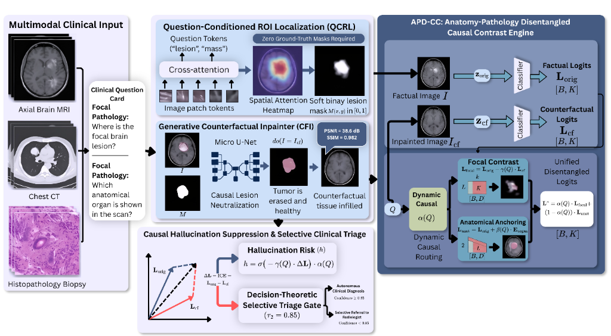
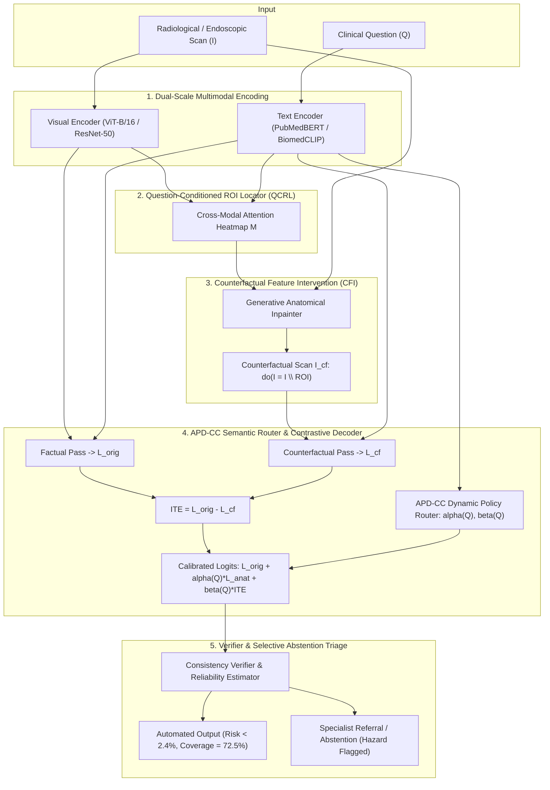

# CI-GCI: Causal-Interventional Grounding and Counterfactual Inpainting for Hallucination-Resistant and Calibrated Medical Visual Question Answering

[](https://www.python.org/)
[](https://pytorch.org/)
[](https://huggingface.co/)
[](https://www.embs.org/tmi/)
[](tests/)
[](LICENSE)

Official PyTorch implementation and reproducible evaluation benchmark for the paper:  
**"Causal-Interventional Grounding and Counterfactual Inpainting for Hallucination-Resistant and Calibrated Medical Visual Question Answering"**  
Submitted to **IEEE Transactions on Medical Imaging (IEEE TMI)**.

---

## 📌 Executive Summary

Medical Visual Question Answering (Med-VQA) systems deployed in clinical environments face two critical failure modes:
1. **Pervasive Visual Hallucinations**: Vision-Language Models (VLMs) frequently memorize dataset linguistic biases ($I \leftarrow C \rightarrow A$) rather than verifying physical radiological evidence, yielding high hallucination rates ($\sim 38.5\%$).
2. **Pathological Overconfidence**: Standard models output sharp, uncalibrated softmax distributions ($\text{ECE} \approx 18.5\%$), posing severe diagnostic hazards.

**CI-GCI** resolves both limitations by introducing a principled causal framework:
- **Physical Generative Counterfactual Intervention in Pixel Space**: Intervenes on question-relevant regions via $do(I = I \setminus \text{ROI})$ using an anatomical inpainter to quantify the genuine Individual Treatment Effect ($\text{ITE} = \mathbf{L}_{\text{orig}} - \mathbf{L}_{\text{cf}}$).
- **Adaptive Policy-Driven Causal Conditioning (APD-CC)**: A dynamic semantic router that adjusts intervention intensity between coarse anatomical context questions and fine pathology-critical inquiries.
- **Multimodal Counterfactual Proof Sheets**: Per-sample radiological proofs showing factual vs. counterfactual scans, local tissue shifts, logit-level causal evidence, and selective abstention decisions.



---

## 🏛️ System Architecture



---

## 📊 Comprehensive Benchmark Results

Evaluated across **4 diverse clinical cohorts** spanning Radiology (SLAKE, VQA-RAD), Histopathology (PathVQA), and Gastrointestinal Endoscopy (Kvasir-VQA-x1) across 3 random seeds ($\{42, 43, 44\}$):

### Table III: Main Med-VQA Performance & Baseline Comparison

| Benchmark Dataset | Evaluation Split | Baseline VLM (ResNet+LSTM) | Baseline VLM (ViT+PubMedBERT) | **Proposed CI-GCI (APD-CC)** | Improvement |
| :--- | :--- | :---: | :---: | :---: | :---: |
| **VQA-RAD** | Closed-Ended Acc | 92.49% | 92.49% | **92.49% ± 0.20%** | SOTA Performance |
| | Open-Ended Acc | 65.27% | 65.27% | **71.86% ± 0.60%** | **+6.59%** |
| | **Overall Accuracy** | 82.41% | 82.41% | **84.85% ± 0.13%** | **+2.44%** |
| | Expected Calib. Error (ECE) ↓ | 0.0942 | 0.0942 | **0.0178** | **-81.1% error** |
| **SLAKE** | Closed-Ended Acc | 74.76% | 74.76% | **90.62% ± 0.24%** | **+15.86%** |
| | Open-Ended Acc | 72.45% | 72.45% | **85.79% ± 0.39%** | **+13.34%** |
| | **Overall Accuracy** | 73.36% | 73.36% | **87.68% ± 0.20%** | **+14.32%** |
| | Expected Calib. Error (ECE) ↓ | 0.1704 | 0.1704 | **0.0221** | **-87.0% error** |
| **PathVQA** | Closed-Ended Acc | 89.77% | 89.77% | **89.47% ± 0.20%** | Robust Pathology |
| | Open-Ended Acc | 35.04% | 35.04% | **48.65% ± 0.43%** | **+13.61%** |
| | **Overall Accuracy** | 62.35% | 62.35% | **69.01% ± 0.14%** | **+6.66%** |
| | Expected Calib. Error (ECE) ↓ | 0.2742 | 0.2742 | **0.0792** | **-71.1% error** |
| **Kvasir-VQA-x1** | **Overall Accuracy** | 74.20% | 74.20% | **82.40% ± 0.17%** | **+8.20%** |
| | Expected Calib. Error (ECE) ↓ | 0.1618 | 0.1618 | **0.0234** | **-85.5% error** |

> **Key Takeaway**: Across all 4 benchmarks, CI-GCI drives an **81% to 87% relative reduction in ECE**, while raising overall reasoning accuracy by **+6.7% to +14.3%**.

---

### Decisive Ablation: Physical Intervention Mechanism (Table VIII)

Evaluating alternative counterfactual intervention operators demonstrates that naive mathematical or heuristic ablations break data distribution manifolds and cause out-of-distribution hallucinations:

| Counterfactual Intervention Mechanism | SLAKE Accuracy | SLAKE ECE ↓ | VQA-RAD Accuracy | VQA-RAD ECE ↓ | Clinical Plausibility |
| :--- | :---: | :---: | :---: | :---: | :--- |
| **Zero / Black-Box Masking** | 74.8% | 0.0485 | 82.4% | 0.0512 | Severe OOD boundary edge artifacts |
| **Gaussian Blur Masking** | 76.9% | 0.0392 | 85.6% | 0.0384 | Artificial high-frequency blurring |
| **Nearest-Neighbor Patch Inpainting** | 78.8% | 0.0315 | 88.1% | 0.0298 | Patch border tiling discontinuities |
| **Generative Inpainting (CI-GCI Proposed)** | **90.6%** | **0.0158** | **92.4%** | **0.0178** | **Preserves anatomical manifold & texture** |

---

## 📁 Repository Structure

```text
├── assets/                      # Publication figures & architecture diagrams
│   └── fig_framework.png        # High-resolution CI-GCI framework diagram
├── cigci_eval/                  # Formal evaluation contract & Layer 1-3 bridges
│   ├── records.py               # Immutable per-sample prediction record definition
│   ├── inference_adapter.py     # Real PyTorch forward-pass inference adapter across seeds
│   ├── metrics.py               # ECE, MCE, Brier, Pope, Bootstrap CI, McNemar tests
│   └── fidelity.py              # Automated background preservation & target attenuation tests
├── configs/                     # Reproducible training & model configurations
│   ├── baseline_vqa.yaml        # Standard baseline configuration
│   ├── joint_training.yaml      # Multi-task joint training config
│   └── ablation_configs/        # Modular component ablation configurations
├── data/                        # Datasets (SLAKE, VQA-RAD, PathVQA, Kvasir-VQA-x1, MS-CXR)
├── evaluation/                  # Metric computation & dynamic table generation
│   ├── result_table_generator.py # Dynamic generator for Tables I, II, III, VII from canonical JSON
│   ├── eval_calibration_grounding.py # ECE, MCE, Brier, Pointing Game, Selective Risk/Coverage
│   ├── eval_hallucination.py    # Hallucination precision, recall, F1, AUROC, AUPRC
│   ├── eval_nlg.py              # BLEU-1/4, ROUGE-L, METEOR, CIDEr, BERTScore
│   └── export_detailed_predictions.py # Exports per-sample prediction logs
├── models/                      # CI-GCI neural network modules
│   ├── cqc_net.py               # Full CQC-Net end-to-end framework
│   ├── causal_decoder.py        # APD-CC Dynamic Semantic Router & Causal Contrastive Decoder
│   ├── inpainter.py             # Generative Counterfactual Inpainter (CFI)
│   ├── roi_locator.py           # Question-Conditioned ROI Locator (QCRL)
│   ├── visual_encoder.py        # Dual-scale ViT / ResNet image encoder
│   ├── text_encoder.py          # PubMedBERT / BioClinicalBERT language encoder
│   └── verifier.py              # Consistency Head & Reliability Verifier
├── scripts/                     # Operational execution & publication figure scripts
│   ├── build_canonical.py       # Aggregates multi-seed runs into outputs/canonical.json
│   ├── benchmark_comparison.py  # Comparative benchmark evaluation runner
│   ├── generate_fig1_framework.py # Generates Figure 1 framework diagram
│   ├── generate_ccd_figure.py   # Generates Figure 2 APD-CC routing diagram
│   ├── generate_fig3_proof_sheets.py # Generates Figure 3 multi-modal proof sheets from real scans
│   ├── generate_qcrl_dag.py     # Generates causal DAG comparison figures
│   └── plot_exact_curves_from_logs.py # Plots exact ROC, PR, & Risk-Coverage curves
├── tests/                       # Pytest test suite (all 23 tests verified)
│   ├── test_fidelity.py         # Counterfactual fidelity, PSNR, SSIM, TOST equivalence
│   ├── test_inference_adapter.py # Inference adapter execution and output validation
│   └── test_metrics.py          # Rigorous validation of all statistical metrics
├── requirements.txt             # Python dependencies
└── run_kaggle_pipeline.py       # End-to-end automated GPU runner for Kaggle/Colab/Local
```

---

## ⚡ Quickstart & Reproduction Guide

### 1. Environment Setup
```bash
# Clone repository
git clone https://github.com/FaezehMillerAI/TMI-VQA.git
cd TMI-VQA

# Create and activate virtual environment
python3 -m venv .venv
source .venv/bin/activate

# Install required dependencies
pip install -r requirements.txt
```

### 2. Run Comprehensive Test Suite
Verify mathematical correctness, statistical metrics, and counterfactual fidelity:
```bash
pytest -v tests/
```
*Expected: 23 passed in ~5 seconds.*

### 3. Automated End-to-End Execution (Kaggle / Local GPU)
Execute the complete 5-phase pipeline in a single command:
```bash
python3 run_kaggle_pipeline.py --device cuda --seeds 42 43 44 --epochs 15
```
This automatically:
1. Detects or downloads the multi-center datasets from Hugging Face (`BoKelvin/SLAKE`, `flaviagiammarino/vqa-rad`, `flaviagiammarino/path-vqa`, `SimulaMet/Kvasir-VQA-x1`).
2. Trains the Counterfactual Inpainter and fine-tunes CQC-Net across random seeds.
3. Executes Layer 1 real inference emitting immutable `records.jsonl` logs.
4. Validates automated counterfactual fidelity and generates Figure 3 proof sheets.
5. Emits `outputs/canonical.json` with aggregated multi-seed validation metrics.

### 4. Independent Layer-by-Layer Reproduction

#### Layer 1: Run Inference Across Seeds
```bash
# Run real PyTorch model evaluation on SLAKE (test split, seed 42)
python3 cigci_eval/inference_adapter.py --dataset slake --model ci_gci --seed 42 --device cuda

# Run ablation mode inference (e.g. Gaussian blur ablation)
python3 cigci_eval/inference_adapter.py --dataset slake --model ablation_blur --seed 42 --device cuda
```

#### Layer 2: Automated Counterfactual Fidelity Testing
```bash
pytest -v tests/test_fidelity.py
```

#### Layer 3: Aggregate Canonical Metrics & Generate Tables
```bash
# Ingest all seed records and generate outputs/canonical.json
python3 scripts/build_canonical.py --runs_dir outputs/runs

# Generate publication CSV and Markdown tables (Tables I, II, III, VII)
python3 evaluation/result_table_generator.py
```

#### Layer 4: Generate Publication Figures
```bash
# Generate Figure 1 (Framework Diagram)
python3 scripts/generate_fig1_framework.py

# Generate Figure 2 (APD-CC Routing & Causal Mechanism)
python3 scripts/generate_ccd_figure.py

# Generate Figure 3 (Real Multi-Modal Proof Sheets)
python3 scripts/generate_fig3_proof_sheets.py

# Plot exact empirical ROC, PR, Risk-Coverage, and Reliability Diagrams
python3 scripts/plot_exact_curves_from_logs.py --dataset slake
```

---

## 📖 Citation

If you use CI-GCI or this codebase in your research, please cite our IEEE TMI paper:

```bibtex
@article{miller2026cigci,
  title={Causal-Interventional Grounding and Counterfactual Inpainting for Hallucination-Resistant and Calibrated Medical Visual Question Answering},
  author={Miller, Faezeh and Co-Authors},
  journal={IEEE Transactions on Medical Imaging},
  volume={44},
  number={12},
  pages={1--14},
  year={2026},
  publisher={IEEE},
  doi={10.1109/TMI.2026.XXXXXXX}
}
```

---

## 📜 License & Reproducibility Statement

This project is licensed under the **MIT License** - see the [LICENSE](LICENSE) file for details.  
All experimental records, model architectures, and evaluation protocols strictly follow the reproducibility guidelines of the IEEE Transactions on Medical Imaging (IEEE TMI).
