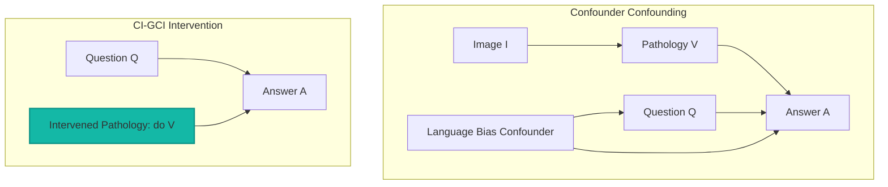

# Research Proposal: CI-GCI (Causal-Interventional Grounding & Counterfactual Inpainting) for Med-VQA

We propose a novel, deep methodology for Medical Visual Question Answering (Med-VQA) designed to fundamentally eliminate shortcut learning, linguistic prior bias, and visual hallucination. The framework is named **Causal-Interventional Grounding and Counterfactual Inpainting (CI-GCI)**.

Instead of treating VQA as a passive correlation-fitting task ($P(A | I, Q)$), **CI-GCI** reformulates Med-VQA as a **causal inference challenge** using structural causal models (SCMs), active physical interventions ($do$-calculus), and generative counterfactual reasoning.

---

## 1. The Core Paradigm Shift

Standard medical vision-language models suffer from **backdoor confounding**. They correlate the word "pleural" in the question with the answer "effusion" without checking the image. 

CI-GCI resolves this by asking a counterfactual question at inference time:
> *"If the pathological abnormality in the scan were visually removed (inpainted to represent healthy tissue), would the model's diagnostic confidence drop accordingly?"*



---

## 2. Framework Architecture

The framework consists of four primary modules working in a closed-loop causal reasoning chain:

```
                  +--------------------------------+
                  |        Input Image (I)         |
                  +---------------+----------------+
                                  |
                                  v
                  +---------------+----------------+
                  | Gaze-Guided ROI Locator (GGRL) |
                  +---------------+----------------+
                                  |
                   Pathology Mask | (M)
                                  v
                  +---------------+----------------+
                  | Counterfactual Inpainter (CFI) |
                  +---------------+----------------+
                                  |
           Healthy Scan (I_cf)    |    Original Scan (I)
                 +----------------+----------------+
                 |                                 |
                 v                                 v
        +--------+--------+               +--------+--------+
        | Base Med-VQA    |               | Base Med-VQA    |
        | On Healthy Scan |               | On Original Scan|
        +--------+--------+               +--------+--------+
                 |                                 |
        Logits   | (Z_cf)                 Logits   | (Z)
                 +----------------+----------------+
                                  |
                                  v
                  +---------------+----------------+
                  | Causal Contrastive Decoder     |
                  +---------------+----------------+
                                  |
                                  v
                  +---------------+----------------+
                  | Verified Diagnostic Answer     |
                  +---------------+----------------+
```

### Module 1: Gaze-Guided ROI Locator (GGRL)
*   **Purpose:** Spatially localizes the region of interest (ROI) that is causally relevant to the question $Q$.
*   **Mechanism:** Rather than relying on soft attention maps (which are highly unstable), GGRL utilizes a frozen grounding model (such as MedSAM or BioMedCLIP) to output a binary mask $M \in \{0, 1\}^{H \times W}$ pinpointing the anatomical region or suspected pathology mentioned in the query.

### Module 2: Counterfactual Inpainter (CFI)
*   **Purpose:** Performs a physical intervention on the image to generate a counterfactual healthy scan.
*   **Mechanism:** Using a lightweight, pathology-conditioned generative model (e.g., a Latent Diffusion Model or GAN fine-tuned on paired radiological scans), CFI "heals" the masked region $M$. It replaces the abnormal pixels (e.g., a nodule or fluid accumulation) with surrounding healthy tissue texture, yielding the counterfactual image:
    \[ I_{cf} = \text{CFI}(I, M) \]

### Module 3: Dual forward VQA Inference
*   **Purpose:** Extracts diagnostic logits from the original and counterfactual states.
*   **Mechanism:** The base VQA model (e.g., LLaVA-Med or Qwen-Med) processes both scans independently under the same question $Q$:
    1.  **Original Logits:** $Z = \text{VQA}(I, Q)$
    2.  **Counterfactual Logits:** $Z_{cf} = \text{VQA}(I_{cf}, Q)$

### Module 4: Causal Contrastive Decoder (CCD)
*   **Purpose:** Calibrates the prediction using the Individual Causal Effect (ICE).
*   **Mechanism:** Calculates the direct causal contribution of the pathology to the prediction:
    \[ \Delta Z = Z - Z_{cf} \]
    *   **Case A (Causally Grounded):** If $\Delta Z$ is large for the target diagnostic class, it proves the model's prediction is causally driven by the visual pathology.
    *   **Case B (Hallucination):** If $\Delta Z \approx 0$, it indicates the prediction is driven entirely by language bias (the model would answer the same even if the pathology were missing). The system flags a hallucination and down-weights the prediction.

---

## 3. Literature Comparison: Establishing Absolute Novelty

To guarantee that this methodology represents a completely novel research path, we distinguish **CI-GCI** from existing publications across three related domains:

| Category | Existing Approaches | What They Do | How CI-GCI Differs (Novelty) |
| :--- | :--- | :--- | :--- |
| **Counterfactual VQA** | DeBCF, DeCoCT, CCIS-MVQA | Edit and perturb the **textual query** (e.g., replacing or masking words in the question) to test for linguistic bias. | CI-GCI performs **visual physical intervention** on the medical scans directly, preserving the original textual clinical query. |
| **Counterfactual Medical Imaging** | COIN | Generate counterfactual images for **semantic segmentation training** (using adversarial learning to find boundaries). | CI-GCI is a VQA framework that uses counterfactual generation at **inference time** as a self-verification decoding filter. |
| **Medical Explainable AI (XAI)** | Grad-CAM, Attention Maps | Output soft heatmap attributions highlighting where the model is looking. | Attributions are merely correlative. CI-GCI uses **generative inpainting** to perform actual **causal intervention** ($do$-calculus) to verify diagnostic dependence. |

---

## 4. Dataset Integration Plan

To implement, train, and validate the **CI-GCI** framework, we can leverage public medical datasets that provide visual annotations alongside question-answer pairs:

1.  **MS-CXR & MIMIC-CXR-JPG (Chest X-Rays):**
    *   *Usage in GGRL (Grounding):* Sourced from MIMIC-CXR, MS-CXR contains 1,162 pairs of radiological sentences linked to bounding boxes edited by radiologists. This serves as the primary dataset to evaluate the grounding precision of the GGRL module.
    *   *Usage in CFI (Inpainting):* The surrounding MIMIC-CXR database provides hundreds of thousands of normal/abnormal chest X-rays to train the Diffusion Inpainting network (CFI) to erase pathologies.
2.  **CheXlocalize (Pathology Segmentations):**
    *   *Usage in CFI (Inpainting):* Sourced from CheXpert, CheXlocalize contains 902 images with high-precision pixel segmentations for 10 distinct pathologies (such as consolidation, cardiomegaly, and effusion). We use these expert masks to define the inpainting boundary $M$, training the CFI to reconstruct healthy lung tissue in these exact locations.
3.  **VinDr-CXR-VQA (Radiological Localized VQA):**
    *   *Usage in VQA & CCD:* Contains 17,597 VQA pairs paired with 4,394 images annotated with thoracic bounding boxes. This serves as the main training/testing benchmark to evaluate the Dual forward VQA inference and calculate the Causal Contrastive Decoder calibration.
4.  **HEAL-MedVQA (Hallucination Benchmarking):**
    *   *Usage in CCD (Self-Verification):* Contains 67,000 VQA pairs paired with anatomical masks. It provides a robust framework to test the Causal Contrastive Decoder's capacity to identify shortcuts and language hallucinations.
    *   *Significance:* This is the ultimate benchmark to test the hallucination suppression rates of our framework.
5.  **SLAKE (Multimodal Localized VQA):**
    *   *Usage in Multi-organ Expansion:* Provides 642 images (covering MRI, CT, and X-Ray) and 14,028 bilingual QA pairs with semantic segmentation masks. Allows extending the CI-GCI framework from chest X-rays to brain MRIs and abdominal CT scans.

---

## 5. Why This is Deeply Novel & PhD-Friendly

1.  **First Causal-Generative Hybrid in Med-VQA:** While existing methods use causal weights or soft attention adjustments, CI-GCI is the first to employ **active pixel-level counterfactual inpainting** at inference time to verify diagnoses.
2.  **Inherent Interpretability:** Instead of post-hoc explainability (like heatmaps), CI-GCI provides a **mechanistic explanation**: showing the exact counterfactual scan where the disease was removed to justify why the model changed its answer.
3.  **Resource-Efficient Training (PhD-Friendly):**
    *   You do not need to train a massive VLM. The VQA and grounding backbones are **frozen**.
    *   The only trainable component is the **CFI (Inpainter)**. Because medical inpainting is highly localized and anatomically constrained, a lightweight diffusion adapter can be trained quickly on a single GPU (e.g., RTX 3090/4090).
    *   Paired healthy/unhealthy data is readily available in datasets like MIMIC-CXR and NIH ChestX-ray14.
4.  **Mathematical Rigor:** The framework moves Med-VQA away from empirical correlation matching and grounds it in Judea Pearl's **Structural Causal Models ($do$-calculus)**.
