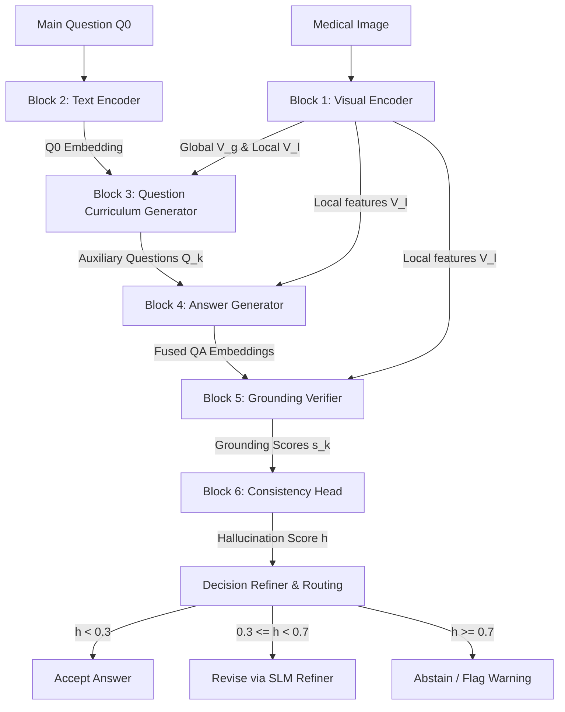

# CQC-Net: Counterfactual Question Curriculum Network

**CQC-Net** is a novel, hallucination-aware deep learning framework designed for Medical Visual Question Answering (Med-VQA). Instead of generating a single isolated answer for a medical query, CQC-Net generates a structured 3-level question curriculum (Existence/Localization, Attribute/Relation, Clinical Inference), computes answers, evaluates grounding against visual evidence, and assesses hallucination risk via hierarchical and directional inconsistency.

---

## 1. Introduction & Background

Medical Visual Question Answering (Med-VQA) assists clinical decision support systems by answering natural language questions about medical images (e.g., X-rays, MRIs, CT scans). Traditional Med-VQA models are prone to **hallucinations**—generating answers that are clinically incorrect, semantically contradictory, or unsupported by visual evidence.

CQC-Net mitigates hallucinations by decomposing the clinical reasoning process into a **Structured Counterfactual Curriculum**. By verifying if a model's clinical diagnosis (Level 3) is supported by its description of attributes (Level 2) and visual detection of structures (Level 1), CQC-Net establishes a logical dependency chain. If a model claims "acute pneumonia is present" but fails to detect "opacities in the lung fields," CQC-Net identifies the clinical inference as a hallucination.

---

## 2. Core Architectural Blocks

CQC-Net is composed of six main block modules integrated end-to-end:

### Block 1: Visual Encoder (Dual-Scale representation)
The visual encoder processes the input medical image \(I \in \mathbb{R}^{H \times W \times C}\) and outputs dual-scale features:
1. **Global Features (\(V_g \in \mathbb{R}^D\))**: Captured via global pooling, representing high-level semantic pathology and modality context.
2. **Local Patch Features (\(V_l \in \mathbb{R}^{L \times D}\))**: Extracted from intermediate feature maps (e.g., \(14 \times 14 = 196\) patch tokens), representing localized anatomical regions for visual grounding.

$$V_g = f_{\text{global}}(I), \quad V_l = f_{\text{local}}(I)$$

*Supported Backbones:* ResNet-101, DenseNet-121, ViT-B/16, or Swin Transformer.

### Block 2: Text Encoder
Encodes natural language questions and answers into semantic dense representations using clinical language models (e.g., PubMedBERT, BioClinicalBERT).

$$Q_0 = \text{Encoder}_{\text{text}}(\text{Question})$$

### Block 3: Question Curriculum Generator (QCG)
The QCG is a Small Language Model (SLM) or projection network that takes the global visual feature \(V_g\) and main question embedding \(Q_0\) to construct a sequence of \(N\) auxiliary questions spanning three logical levels:
* **Level 1 — Existence / Localization:** Verifies if an anatomical structure or abnormality is visible (e.g., *"Is there fluid in the pleural cavity?"*).
* **Level 2 — Attribute / Relation:** Examines shape, size, severity, or relations (e.g., *"Is the pleural line thickened?"*).
* **Level 3 — Clinical Inference:** Interprets pathological diagnoses (e.g., *"Does the pattern suggest acute pleural effusion?"*).

$$\{Q_k^{(l)}\}_{k=1}^N = \text{QCG}(V_g, Q_0)$$

### Block 4: Answer Generator
Computes answers for both the main question \(Q_0\) and the generated auxiliary questions. It maps question features to local patch tokens \(V_l\) using **Multi-Head Cross-Attention** to focus on the relevant visual areas.
* **Classification Head**: Produces logits over closed-form outputs (e.g., yes/no).
* **Generative Decoder**: Outputs text sequences for open-ended clinical descriptions.

$$P(A_k | I, Q_k) = \text{Decoder}(\text{CrossAttention}(Q_k, V_l))$$

### Block 5: Grounding & Evidence Verifier
Evaluates whether a generated answer is grounded in visual evidence. It fuses the local image features, question features, and the generated answer representation to output:
1. **Image-Answer Compatibility (\(s^{\text{img}}\))**: Semantic similarity between the visual region and answer words.
2. **QA Entailment (\(s^{\text{qa}}\))**: Contradiction/entailment classifier checking if the answer logically completes the question.
3. **Region Attribution (\(\text{box} = [x_1, y_1, x_2, y_2]\))**: Bounding box coordinates pointing to the evidence.

$$s_k = \alpha \cdot s_k^{\text{img}} + \beta \cdot s_k^{\text{qa}}$$

### Block 6: Curriculum Consistency and Hallucination Head
Aggregates grounding scores from Block 5. It builds a consistency vector \(c = [\bar{s}^{(1)}, \bar{s}^{(2)}, \bar{s}^{(3)}, s_0]\), where \(\bar{s}^{(l)}\) is the average grounding score at level \(l\), and \(s_0\) is the grounding score of the main question.
* **Directional Inconsistency Detector**: Uses a Gated Recurrent Unit (GRU) to evaluate the sequence of scores over curriculum levels. If there is a sharp drop-off in grounding score from Level 1 to Level 3, it signals a hallucinated diagnosis.

$$h = \sigma(\text{MLP}(c) + \text{GRU}(c))$$

Where \(h \in [0.0, 1.0]\) represents the final hallucination risk probability.

---

## 3. Decision Refiner & Routing Policy

During inference, CQC-Net executes a clinical trust routing policy based on the hallucination score \(h\) and thresholds \(\tau_{\text{low}} = 0.3\), \(\tau_{\text{high}} = 0.7\):
* **Accept (\(h < \tau_{\text{low}}\))**: High confidence and consistency; outputs the original answer.
* **Revise (\(\tau_{\text{low}} \le h < \tau_{\text{high}}\))**: Moderate inconsistency; routes visual features, question features, and original answers to the **SLM Refiner** to generate a corrected prediction.
* **Abstain / Flag (\(h \ge \tau_{\text{high}}\))**: High risk of hallucination; flags a safety warning or refuses to answer to prevent diagnostic errors.

---

## 4. Multi-Stage Training Protocol

CQC-Net is trained in sequential research stages:

1. **Stage 1 (Baseline Med-VQA)**: Optimizes the Visual/Text Encoders and Answer Generator on original QA pairs using QA cross-entropy loss.
2. **Stage 2 (Curriculum Construction)**: Pre-generates the 3-level question-answering curriculum chains.
3. **Stage 3 (QCG Training)**: Freezes encoders and trains the curriculum generator to output correct embeddings and level classes.
4. **Stage 4 (Joint Training)**: Freezes QCG, training the Answerer, Verifier, and GRU Consistency Head under the total multi-task loss.
5. **Stage 5 (End-to-End Fine-Tuning)**: Unfreezes all parameters for joint end-to-end alignment.
6. **Stage 6 (Calibration)**: Sets the trust routing thresholds (\(\tau_{\text{low}}, \tau_{\text{high}}\)) on validation splits.

---

## 5. Multi-Task Objective Loss

$$\mathcal{L}_{\text{total}} = \lambda_1 \mathcal{L}_{\text{QA}} + \lambda_2 \mathcal{L}_{\text{ground}} + \lambda_3 \mathcal{L}_{\text{cons}} + \lambda_4 \mathcal{L}_{\text{hallu}} + \lambda_5 \mathcal{L}_{\text{cal}}$$

* **QA Loss (\(\mathcal{L}_{\text{QA}}\))**: Cross-entropy on main and auxiliary answer predictions.
* **Grounding Loss (\(\mathcal{L}_{\text{ground}}\))**: Mean Squared Error (MSE) on visual bounding box coordinates.
* **Consistency Loss (\(\mathcal{L}_{\text{cons}}\))**: Relu penalty enforcing that higher-level clinical inference grounding cannot exceed ground-level visual detail grounding:

$$\mathcal{L}_{\text{cons}} = \sum_{l=1}^2 \max(0, \bar{s}^{(l+1)} - \bar{s}^{(l)} + \delta)$$

* **Hallucination Loss (\(\mathcal{L}_{\text{hallu}}\))**: Binary Cross-Entropy on hallucination risk probability \(h\).
* **Calibration Loss (\(\mathcal{L}_{\text{cal}}\))**: Brier score surrogate checking alignment between confidence and correctness.
