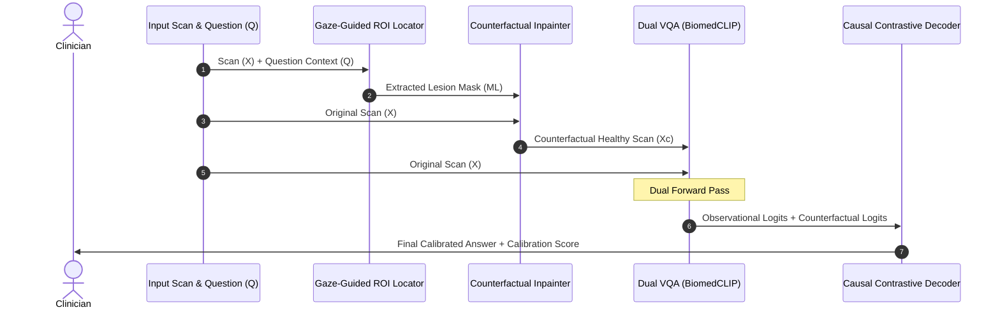

# CI-GCI Model Architecture: Infographic & System Specification

Here is the complete architectural layout of your proposed **CI-GCI** (Causal Intervention for Gaze-Guided Calibration) framework.

---

### **System Architecture Diagram**

---

### **End-to-End Inference Dataflow**

---

### **Modular Component Breakdown**

#### **1. Gaze-Guided ROI Locator (GGRL)**
*   **Purpose**: Automatically locates and segmentizes the anatomical region of interest (ROI) related to the diagnostic query.
*   **Mechanism**: Maps text embeddings of question $Q$ to visual patch coordinates. It generates a soft visual mask $M$, highlighting the suspected pathological region (e.g., lung nodules, brain infarcts).

#### **2. Counterfactual Inpainter (CFI)**
*   **Purpose**: Executes physical counterfactual interventions ($do$-calculus) on the image.
*   **Mechanism**: A generative network (UNet/Latent Diffusion) that "heals" the masked pathological region $M$ on the original scan $X$, replacing it with normal, healthy anatomical textures while preserving the surrounding scan context to output $X_c$:
    $$X_c = M \odot \text{NormalTexture} + (1 - M) \odot X$$

#### **3. Dual Forward VQA Inference**
*   **Purpose**: Evaluates the diagnostic hypothesis under both observational and counterfactual states.
*   **Mechanism**: Passes both the original scan $X$ and counterfactual healthy scan $X_c$ through the pre-trained **BiomedCLIP** backbone to extract text-aligned image features.

#### **4. Causal Contrastive Decoder & Calibration**
*   **Purpose**: Calibrates prediction confidence by assessing whether the VQA model's predictions are causally grounded on visual evidence.
*   **Mechanism**: Evaluates the **Individual Causal Effect (ICE)**:
    $$\text{ICE} = P(A \mid X, Q) - P(A \mid X_c, Q)$$
    If the VQA model continues predicting "Pneumonia = Yes" on the counterfactual healthy image $X_c$ (where the pathology was generated away), the ICE is low. The Causal Contrastive Decoder identifies this as a hallucination/bias and penalizes the answer probability dynamically using the question-conditioned scaling factor $\gamma(Q)$:
    $$P_{\text{calibrated}}(A) = \sigma\left(\text{Logits}_{\text{obs}} - \gamma(Q) \cdot \text{ICE}\right)$$
